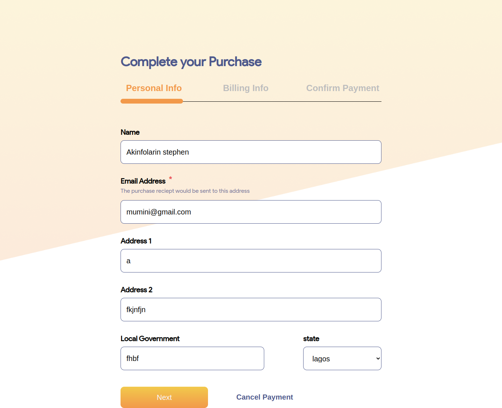

<h3>Task 1 for frontend developers technology used: react, typescript,formik</h3>
<h2>link to deploy version</h2>
<a href="https://shiny-brioche-7e8e16.netlify.app/">visit live version  here</a>
<h2>

Technical Run down

1. it is responsive  both on desktop and mobile
2. enable form field validation
</h2>

End Product:

</img>